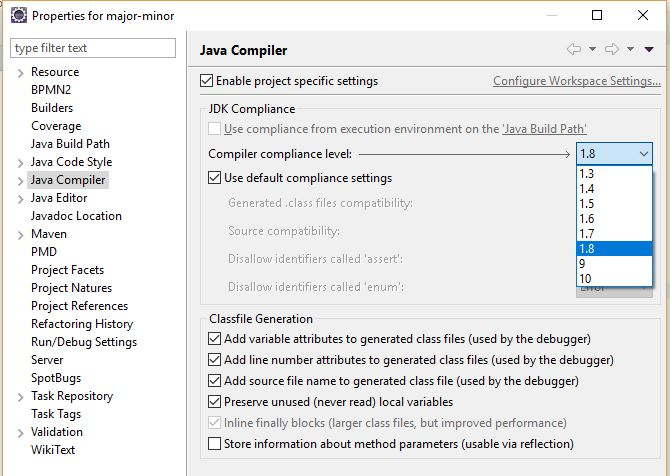
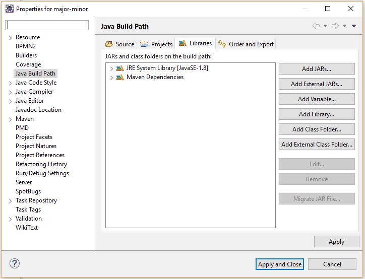
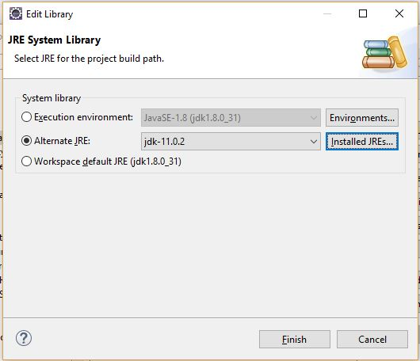
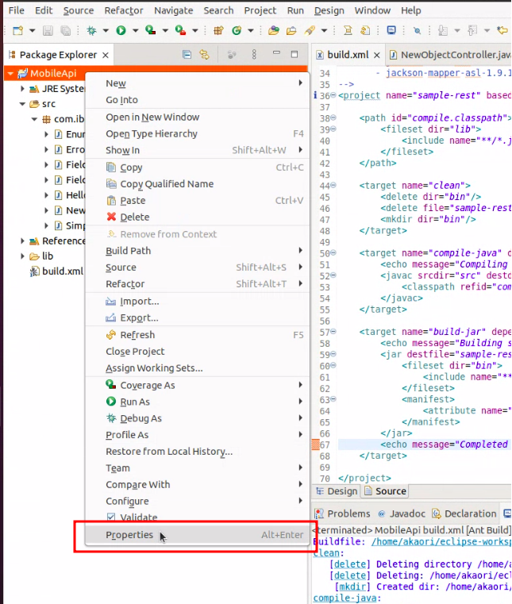
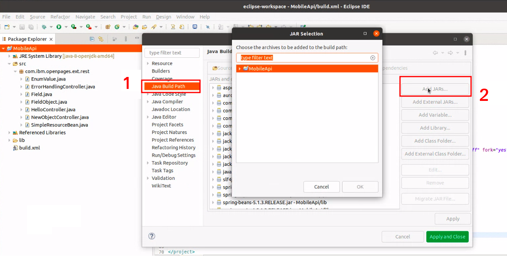
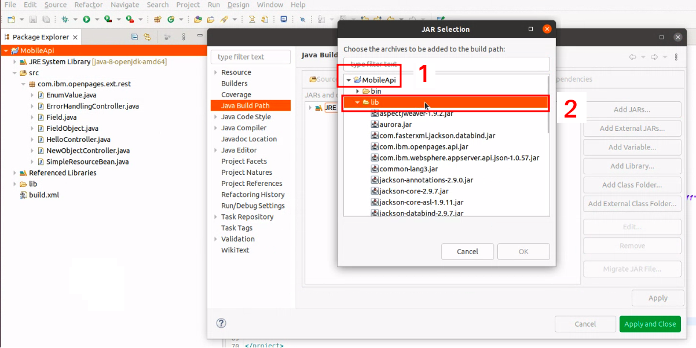
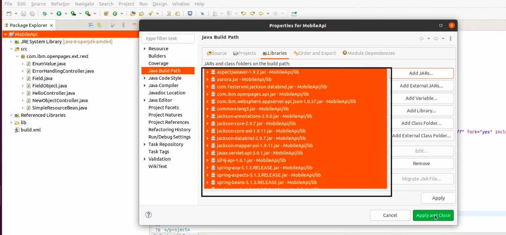
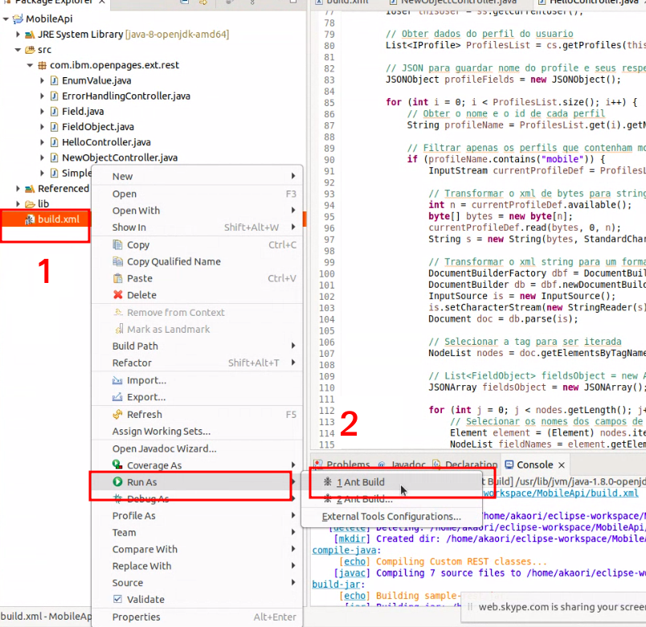

# OpenPages Custom Actions

## Documentações importantes:

- [Como Criar Custom Actions - IBM](https://www.ibm.com/docs/en/opw/8.0.0?topic=guide-creating-custom-actions-grc-workflows)
- [API Interna do OpenPages - IBM](https://public.dhe.ibm.com/software/data/cognos/documentation/openpages/en/8.2.0/javadoc/index.html?com/ibm/openpages/api/resource/IResource.html)

## Observações Importantes

- Você deve ter o Java 8 JDK para compilar e construir seu código-fonte.
- Recomenda-se que você tenha o Eclipse (JAVA EE).
- Utilizar a versão do OpenPages acima da 8.0.0.2.
- Você precisará de acesso ao servidor para obter os arquivos necessários e implantar seus jars.
- Ao clonar o repositório, extraia a pasta lib.zip (a pasta lib extraída será utilizada para compilar, portanto todas a bibliotecas necessárias deverão estar nesta pasta). 
- Como a pasta lib é pesada, não é possível colocá-la no github, portanto sempre certifique-se de zipar ela com as novas bibliotecas adicionais e dar o push para o repositório ficar atualizado.

## Configurações Importantes

- É necessário o **Java 8 JDK** (é o mesmo que JAVA 1.8) para compilar e construir o código.
- A versão mínima do OpenPages é 8.0.0.2.
- Descompactar a pasta lib.zip

> ⚠ Para checar a versão do Java no Eclipse, vá em `Help > About Eclipse IDE > Installation Details > Configuration`.

> Procure por `eclipse.vm` e `java.version`.

Caso não seja a versão 8, siga os seguintes passos:

1. **Mudando o nível do Compilador**

	- Vá em `Project > Properties > Java Compiler`

Para mais informações, acesse este [link](https://www.baeldung.com/java-lang-unsupportedclassversion)

2. **Mudando o JRE no Eclipse**

	- Vá em `File > Open Project from File System`
	- Vá até o diretório em que está o projeto, e selecione-o
	- Depois de aberto o projeto, vá em `Project > Properties > Java Build Path`
	  
	- Clique na aba `Libraries`
	- Selecionar `JRE System Library`
	- Clicar em `Edit`
	- Selecionar `Alternate JRE`, apertar em `Installed JREs`
	  
	- Clicar em `Add > Standart VM > Next > Directory`
	- Apontar para o caminho do **Java 8 SDK** (se não tiver, será necessário instalar)

3. **Importando bibliotecas externas**

	- Para este projeto, as bibliotecas necessárias estão no arquivo `lib.zip`.Extrair este arquivo no mesmo diretório.
	  
	- Selecione a pasta do projeto, e clique com o botão direito do mouse em cima.
	  
	- Selecione a opção `Properties > Java Build Path > Libraries`
	- Clique na opção `Add Jars`
	  
	- Procure a pasta `lib`, selecione todos os arquivos `.jar` dentro dela
	  
	- Clique `Ok`
	- Clique `Apply and Close`

4. **Compilando**

	- Primeiramente, certifique-se que todas as denpedências estejam na pasta `lib`
	- Clicar com o botão direito do mouse em cima do arquivo `build.xml`

	- Ir em `Run As > Ant Build`
	- Checar se não há erros

5. **Implatanção no OpenPages**

	- Copiar o arquivo `.jar` gerado para a o diretório `<OpenPages_Home>\aurora\op-ext-lib`
	- Para testar o `.jsp`, copiar o arquivo para o diretório `<OpenPages_Home>\wlp-usr\shared\apps\op-apps.ear\sosa.war`
	- Reiniciar todos os serviços do OpenPages
	- No OpenPages, com um usuário Administrador, confirmar que o`Registry Setting` está configurado como `true`. Para habilitar o `Custom REST Services` vá em `/Platform/API/Custom/Enable Custom REST Service`
> OBS: para mudar o `registry setting` não é necessário reiniciar o serviço
